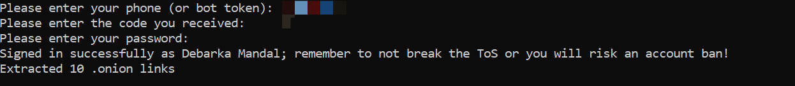
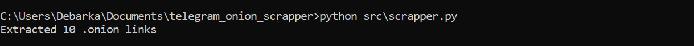

# Telegram .onion Link Extractor

This tool extracts `.onion` links from public Telegram channels using the Telegram API and saves them in a structured JSON format.

---

## 🧰 Features

- ✅ Extracts `.onion` URLs using regex
- ✅ Connects via Telegram API using Telethon
- ✅ Deduplicates with message ID tracking
- ✅ JSON output with timestamps and context
- ✅ Gracefully handles rate limits

---

## ⚙️ Setup Instructions

1. **Get Telegram API credentials** from [my.telegram.org](https://my.telegram.org).
2. Clone the repo and install dependencies:
```bash
git clone https://github.com/yourusername/telegram-onion-extractor.git
cd telegram-onion-extractor
pip install -r requirements.txt

```
▶️ How to Run the Script

Open your terminal and navigate to the project directory.

Run the script using Python:
```bash
python src/scrapper.py
```
The script will:
1. Connect to the Telegram channel
2. Extract .onion links from recent messages
3. Save the results in outputs/onion_links.json
4. Track last scanned message in config/last_message_id.txt

After running you will see something like this:

For first time
1. You need to enter your phone number
2. Enter the login code that you received in telegram
3. Enter your password



After logging in if you run you get only the output:

